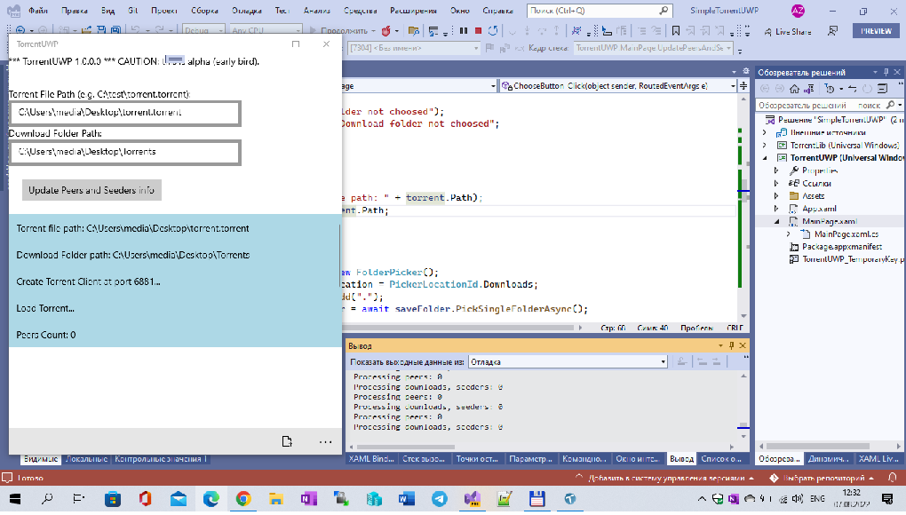

# SimpleTorrentUWP
Some in-progress fork of Empyreal96/SimpleTorrentUWP project.  

Min. os. build: 14393

## Screenshots

  
## Current issues:  
- Timeout exception when connecting to TCPClient with *any* torrent (?)

## Changes:  
- Added use of StorageFile to allow access to files instead of hard paths  
- Namespace change

## Referencies:
  Https://GitHub.Com/Empyreal96/SimpleTorrentUWP

 
##.

AS IS. No support. RnD only.

- [m][e] 2022